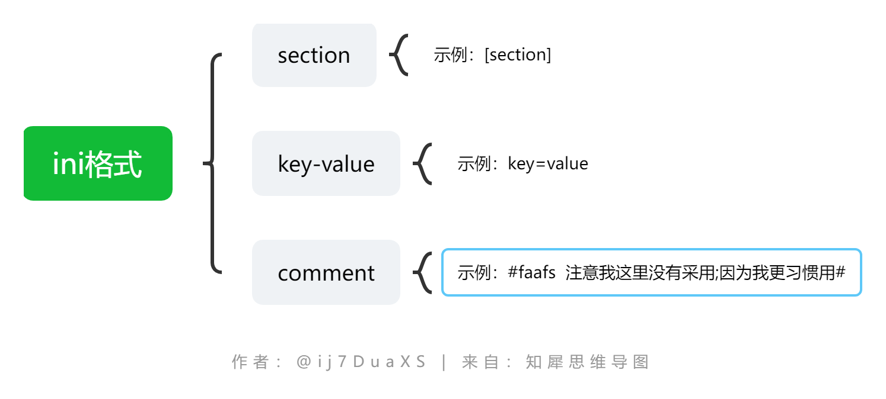
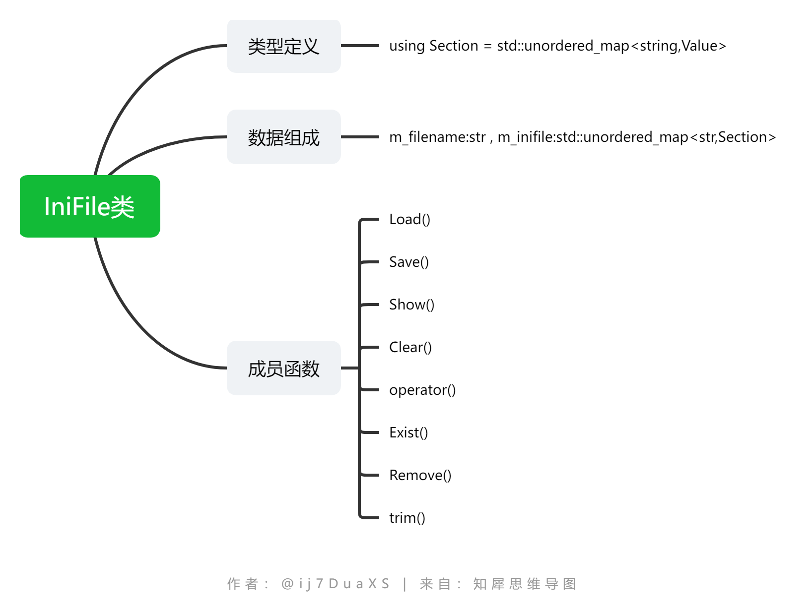

## ini格式说明

格式组成如下：


## 解析代码实现

> 由于格式简单，且连格式嵌套都没有，所以组成就非常简单了，直接一个Value类用于存下值，方便任意类型的隐式转化，其他的均在IniFile里实现。

IniFile类的组成：



## 简单使用

```cpp
#include <iostream>
#include "ini-parser/IniFile.h"


int main() {
    IniFile f;
    //加载配置文件
    f.Load("../test_source/test.ini");
    //打印结果
    f.Show();
    //保存结果到文件
    f.Save("../test_source/pp.ini");

    //根据section和key value
    string ip = f["redis"]["host"];
    int port = f["redis"]["port"];
    std::cout<<"redis ip:"<<ip<<"\n";
    std::cout<<"redis port:"<<port<<"\n";
    return 0;
}
```